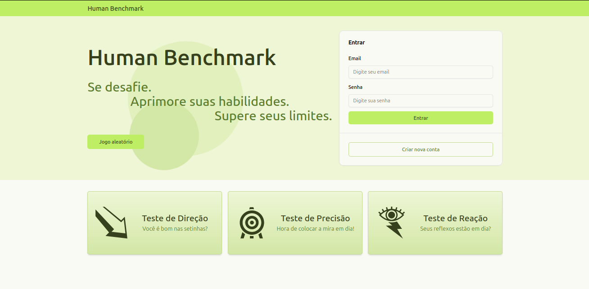
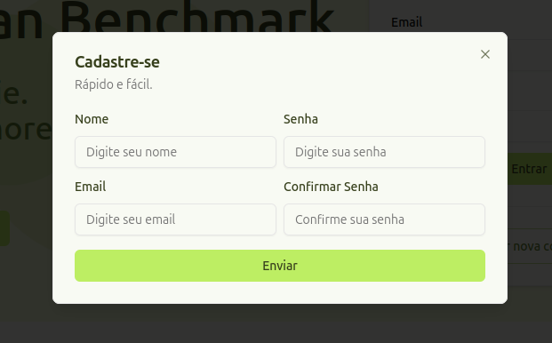
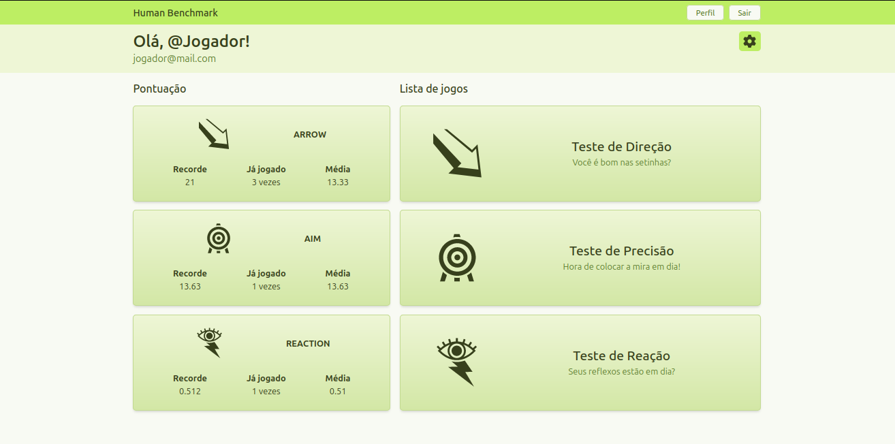
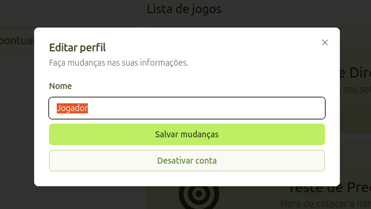
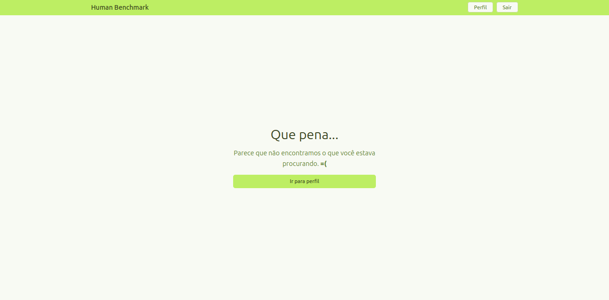
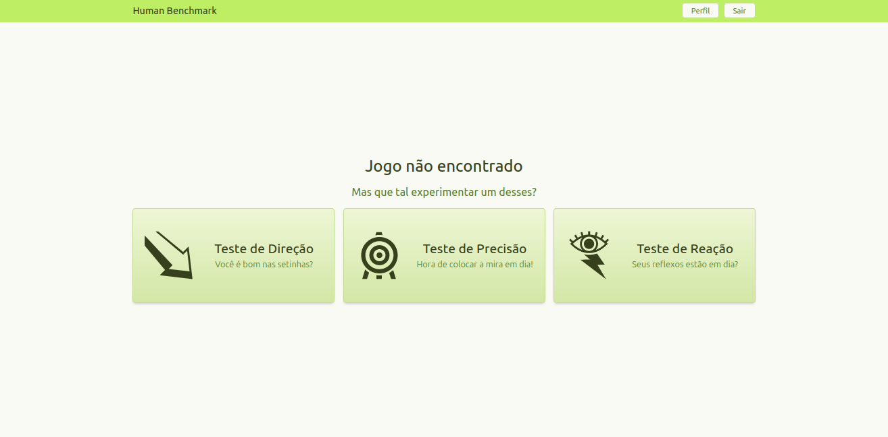
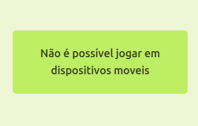

# Human Benchmark

Bem-vindo ao Human Benchmark, um projeto desenvolvido por [GPMLAD](https://github.com/GPMLAD/) e [Typhonn003](https://github.com/Typhonn003) que oferece uma série de minigames projetados para testar e avaliar diversas habilidades cognitivas dos usuários. Nosso objetivo é proporcionar uma plataforma divertida e interativa onde os usuários possam desafiar a si mesmos e acompanhar seu progresso ao longo do tempo.

## Sobre o projeto

Desenvolvido utilizando:

- React
- Next.js (Pages Router)
- `<canvas>`
- Tailwind
- Shadcn ui
- Radix
- Zod
- Zustand
- Typescript
- Express

## Design

## 404

Caso a url esteja errada, as seguintes opções podem aparecer:

## Jogos

Os jogos foram pensados para serem jogados apenas no desktop, utilizando teclado e mouse.

Segue abaixo uma amostra dos jogos:

### Direção

<video width="320" height="240" controls>
  <source src="./docSrc/arrow.mp4" type="video/mp4">
</video>

### Precisão

<video width="320" height="240" controls>
  <source src="./docSrc/aim.mp4" type="video/mp4">
</video>

### Reação

<video width="320" height="240" controls>
  <source src="./docSrc/reaction.mp4" type="video/mp4">
</video>

## Back-End

A documentação da API pode ser encontrada [aqui!](https://github.com/Typhonn003/human_benchmark_api)
